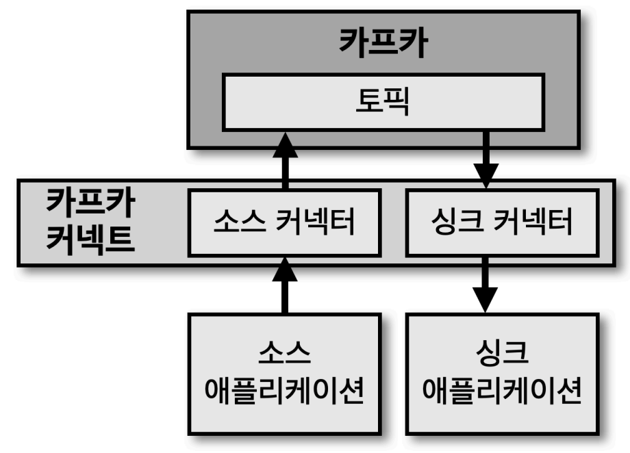
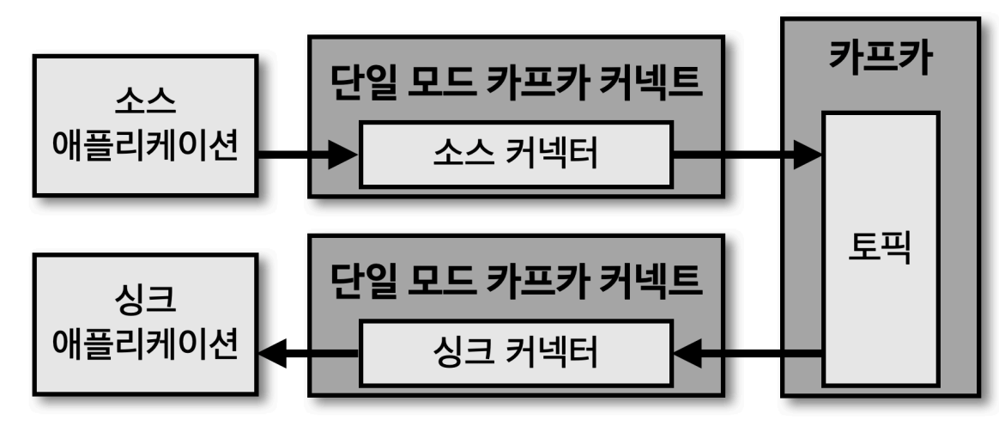
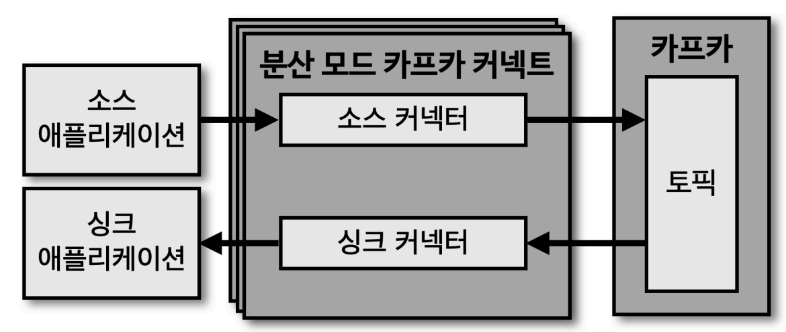
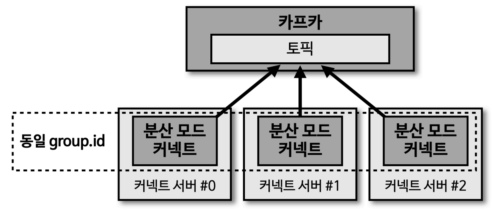
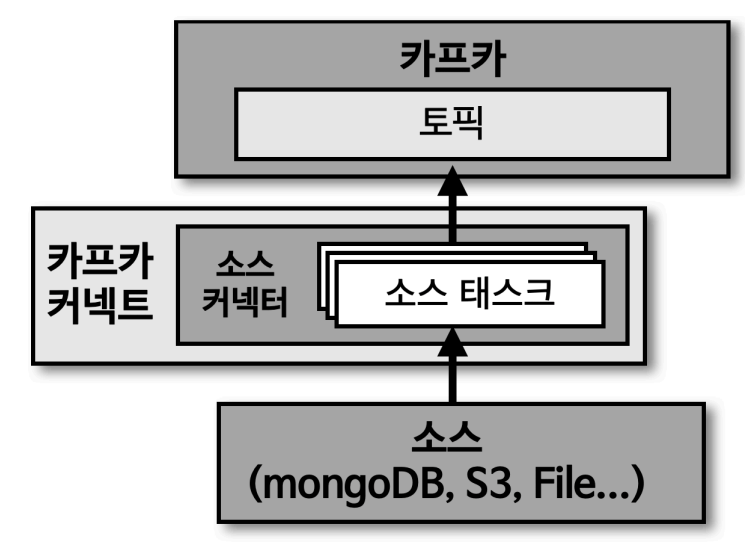
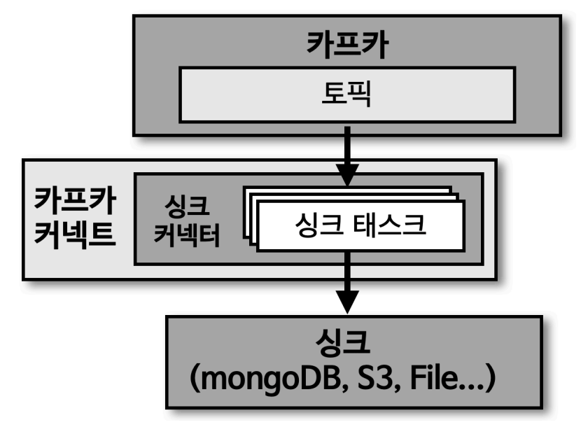

# Kafka Connect

## 카프카 커넥트

### 카프카 커넥트



- 데이터 파이프라인 생성 시 반복 작업을 줄이고 효율적인 전송을 위한 애플리케이션
- 특정 작업 형태를 템플릿으로 만든 **커넥터**를 실행함으로써 반복 작업을 줄일 수 있음
- **커넥트** : 커넥터를 실행하기 위한 프로세스
- **커넥터** : 실제로 내부에서 스레드 형태로 실행되는 것

### 카프카 커넥트 내부 구조


- 사용자가 커넥트에 커넥텨 명령을 내림 → 커넥트는 내부에 **커넥터**와 **태스크**를 생성함
- 커넥터의 구성요소
  - 커넥트 : 태스크를 운영하는 프로세스
  - 태스크 : 실질적인 데이터 처리 (컨슈머/프로듀서)
- 데이터 처리가 정상적으로 작동하는지 확인하기 위해서는 **각 태스크의 상태**를 확인해야함

### 커넥터

- 커넥터의 종류
  - **소스 커넥터 (source connector)** := 프로듀서
  - **싱크 커넥터 (sink connector)** := 컨슈머
- 커넥터 플러그인
  - 커넥트를 추가하고 활용하기 위해 사용
  - `jar` 파일 형태
  - [오픈소스 커넥터](https://www.confluent.io/hub/) : HDFS, AWS S3, JDBC, ElasticSearch…
  - 직접 개발 커넥터 : `implementation 'org.apache.kafka:connect-api:{version}'`
- 커넥터를 사용해 파이프라인 생성 시 추가로 설정 가능한 옵션
  - **컨버터 (converter)** : 데이터 처리 전 스키마 변경 가능
  - **트랜스폼 (transform)** : 데이터 처리 시 각 메시지 단위로 데이터를 간단하게 변환하기 위한 용도
- Connect REST API interface
  - 커넥트 자체에서 인터페이스를 제공하므로 직접 개발할 필요는 없음
  - 새로운 커넥터 생성, 현재 실행 중인 커넥트 플러그인 종류, 태스크 상태, 커넥터 상태 조회 가능

## 단일 모드 커넥트 (Standalone mode Kafka Connect)



- 커넥트가 **1개 프로세스**로 실행
- 단일 프로세스로 실행 ⇒ **단일 장애점(SPOF: Single Point Of Failure)**가 될 수 있음
- 실행 방법 : `bin/connect-standalone.sh <커넥트 설정 파일> <커넥터 설정 파일>`

  - 커넥트 설정 파일 : `config/connect-standalone.properties`

    ```python
    # 카프카 브로커 정보
    bootstrap.servers=my-kafka:9092

    # key, value 직렬화/역직렬화 컨버터 정보
    key.converter=org.apache.kafka.connect.json.JsonConverter
    value.converter=org.apache.kafka.connect.json.JsonConverter
    key.converter.schemas.enable=false
    value.converter.schemas.enable=false

    # offset 정보 저장 위치
    offset.storage.file.filename=/tmp/connect.offsets
    offset.flush.interval.ms=10000

    # 추가할 플러그인의 위치
    plugin.path=/usr/local/share/java,/usr/local/share/kafka/plugins
    ```

  - 커넥터 설정 파일 : `config/connect-file-source.properties`
    ```python
    name=local-file-source
    connector.class=FileStreamSource # 실행시킬 커넥터의 종류
    tasks.max=1 # 파티션 개수와 동일하게 지정하는 것이 좋음
    file=/tmp/test.txt
    topic=connect-test
    ```

## 분산 모드 커넥트 (Distributed mode Kafka Connect)





- 2개 이상의 프로세스가 1개의 그룹으로 묶여서 운영 ⇒ 커넥터가 스레드로 실행됨
- **동일한 `group.id`**를 지정하면 동일한 클러스터로 묶임
- **failover** 및 **scale-out** 가능 ⇒ 데이터 처리량 변화에 유연하게 대응 가능

### 실습

1. 설정 파일 : `config/connect-distributed.properties`

   ```python
   # 카프카 브로커 정보
   bootstrap.servers=my-kafka:9092

   # 클러스터 정보
   group.id=connect-cluster

   # key, value 직렬화/역직렬화 컨버터 정보
   key.converter=org.apache.kafka.connect.json.JsonConverter
   value.converter=org.apache.kafka.connect.json.JsonConverter
   key.converter.schemas.enable=false
   value.converter.schemas.enable=false

   # 커넥트 운영 시에 필요한 오프셋/설정/상태 정보를 담기 위한 토픽 생성
   # 모든 프로세스가 종료되어도 정보가 저장되어있음
   # 미리 생성하거나 커넥트 실행 시에 자동 생성되도록 설정
   # 그룹 아이디별로 생성
   offset.storage.topic=connect-offsets
   offset.storage.replication.factor=1
   config.storage.topic=connect-configs
   config.storage.replication.factor=1
   status.storage.topic=connect-status
   status.storage.replication.factor=1

   offset.flush.interval.ms=10000

   # 추가할 플러그인의 위치
   plugin.path=/usr/local/share/java,/usr/local/share/kafka/plugins
   ```

2. 분산 모드 커넥트 실행

   ```bash
   $ bin/connect-distributed.sh config/connect-distributed.properties
   ```

3. 플러그인 확인 : 분산 모드 카프카 워커에 현재 실행되고 있는 카프카 커넥트에 어떤 플러그인이 있는지 확인 가능

   ```bash
   $ curl -X GET http://localhost:8083/connector-plugins
   [
   	{
   		"class": "org.apache.kafka.connect.file.FileStreamSinkConnector",
   		"type": "sink",
   		"version": "2.5.0"
   	},
   	...
   ]
   ```

4. `FileStreamSinkConnector` 테스트

   - `tasks.max` : 실행할 태스크 스레드 개수 지정. 보통 파티션 개수와 동일하게 운영

   ```bash
   $ curl -X POST http://localhost:8083/connectors \
   			-H 'Content-Type: application/json' \
   			-d {
   				"name" : "file-sink-test",
   				"config" :
   					{
   						"topics" : "test",
   						"connector.class" : "org.apache.kafka.connect.file.FileStreamSinkConnector",
   						"tasks.max" : 1,
   						"file" : "/tmp/connect-test.txt"
   					}
   			}
   ```

5. `FileStreamSinkConnector` 실행 확인

   ```bash
   $ curl http://localhost:8083/connectors/file-sink-test/status
   {
   	"name": "file-sink-test",
   	"connector": {
   		"state": "RUNNING",
   		"worker_id": "127.0.0.1:8083"
   	},
   	"tasks": [
   		{
   			"id": 0,
   			"state": "RUNNING",
   			"worker_id": "127.0.0.1:8083"
   		}
   	],
   	"type": "sink"
   }
   ```

6. `FileStreamSinkConnector`로 생성된 파일 확인

   ```bash
   $ bin/kafka-console-producer.sh --bootstrap-server my-kafka:9092 --topic connect-test
   >a
   >b
   >c
   >d
   >e
   >f
   >g

   $ cat /tmp/connect-test.txt
   a
   b
   c
   d
   e
   ```

7. `FileStreamSinkConnector` 종료

   ```bash
   $ curl http://localhost:8083/connectors
   ["file-sink-test"]

   $ curl -X DELETE http://localhost:8083/connectors/file-sink-test

   $ curl http://localhost:8083/connectors
   []
   ```

## [커스텀 소스 커넥터](./simple-source-connector/)



- **`SourceConnector`**
  - 태스크를 실행하기 전 **커넥터 설정 파일**을 초기화하고 **어떤 태스크 클래스**를 사용할 것인지 정의
- **`SourceTask`**
  - 소스 애플리케이션 또는 소스 파일로부터 데이터를 가져와 토픽으로 **넣는** 역할
  - 토픽에서 사용하는 오프셋이 아닌 **자체적으로 사용하는 오프셋** 사용
    - 소스 애플리케이션 또는 소스 파일을 **어디까지 읽었는지** 저장
    - 데이터를 중복해서 토픽으로 보내는 것 **방지**
- `implementation 'org.apache.kafka:connect-api:2.5.0'`
- 빌드된 파일을 jar로 압축하기 위한 스크립트
  - 커텍터를 개발하고 플러그인으로 커넥트를 추가할 때 사용자가 직접 작성한 클래스뿐만 아니라 **참조하는 라이브러리도 함께 빌드**하여 jar로 압축해야함 ⇒ `ClassNotFoundException`
  ```groovy
  jar {
  	  from {
  	      configurations.compile.collect { it.isDirectory() ? it : zipTree(it) }
  	  }
  }
  ```

## [커스텀 싱크 커넥터](./simple-sink-connector/)



- **`SinkConnector`**
  - 태스크를 실행하기 전 **커넥터 설정 파일**을 초기화하고 **어떤 태스크 클래스**를 사용할 것인지 정의
- **`SinkTask`**
  - 토픽의 데이터를 타깃 애플리케이션 또는 타깃 파일로 **저장**하는 역할
- `implementation 'org.apache.kafka:connect-api:2.5.0'`
