# Kafka Consumer

## 카프카 컨슈머

### 카프카 컨슈머

적재된 데이터를 사용하기 위해 브로커로부터 데이터를 가져와서 필요한 처리함

### 카프카 컨슈머 내부 구조

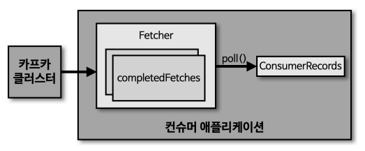

- **Fetcher** : 리더 파티션으로부터 레코드들을 미리 가져와서 대기
- **poll()** : Fetcher에 있는 레코드들를 리턴하는 레코드
- **ConsumerRecords** : 처리하고자 하는 레코드의 모음. 오프셋이 포함되어 있음

## 컨슈머 그룹

### 컨슈머 그룹

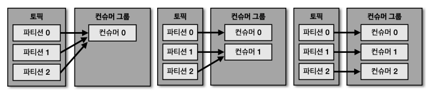

- 컨슈머를 각 컨슈머 그룹으로부터 격리된 환경에서 안전하게 운영할 수 있도록 도와줌
- 동일한 컨슈머 그룹에 있는 컨슈머는 ~~대부분~~ 동일한 로직을 가지고 있음
- 컨슈머 그룹으로 묶인 컨슈머들은 토픽의 1개 이상 파티션들에 할당되어 데이터를 가져갈 수 있음
- 컨슈머 그룹의 컨슈머 개수는 가져가고자 하는 토픽의 파티션 개수보다 같거나 작아야 함

  - 컨슈머 그룹으로 묶인 컨슈머가 토픽을 구독해서 데이터를 가져갈 때, 1개의 파티션은 최대 1개의 컨슈머에 할당 가능
  - 1개의 컨슈머는 여러 개의 파티션에 할당 가능
  - 1:1 매칭 시 최대 성능을 냄
  - 컨슈머 그룹의 컨슈머 > 파티션 개수

    - 파티션을 할당받지 못하는 컨슈머가 있음 ⇒ 유휴 상태
    - 스레드만 차지하고 실질적인 데이터 처리 X

      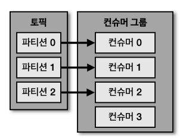

### 컨슈머 그룹을 활용하는 이유

카프카를 활용하지 않고 수집한 데이터를 동기적으로 적재 요청을 하는 경우, 하나에 장애가 발생한다면 다른 곳에도 적재 불가능

⇒ 같은 저장소에 저장하는 컨슈머를 하나의 컨슈머 그룹으로 묶어 **각 저장소의 장애에 격리되어 운영** 가능

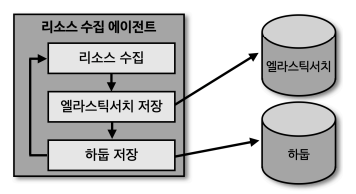

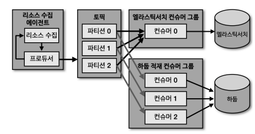

## 리밸런싱(rebalancing)

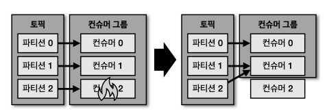

- 컨슈머 그룹으로 이루어진 컨슈머 중 일부 컨슈머에 장애 발생 시, 장애가 발생한 컨슈머에 할당된 파티션은 장애가 발생하지 않은 컨슈머에 소유권이 넘감
- 컨슈머가 **추가**되거나 **제외**되면 **최대 처리량**을 위해 파티션-컨슈머를 재할당함

## 커밋(commit)

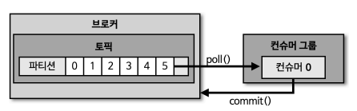

- 컨슈머는 카프카 브로커로부터 데이터를 어디까지 가져갔는지 **커밋**을 통해 기록함
- **특정 토픽의 파티션을 어떤 컨슈머 그룹이 몇 번째 가져갔는지** 카프카 브로커의 내부 토픽 `__consumer_offsets`에 기록됨
- 컨슈머 동작 이슈가 발생하여 오프셋 커밋이 기록되지 못했다면 데이터 처리의 **중복**이 발생할 수 있음

  ⇒ 컨슈머 애플리케이션이 오프셋 커밋을 정상적으로 처리했는지 **검증** 필요

## 어사이너(Assignor)

컨슈머와 파티션 할당 정책은 컨슈머의 assignor에 의해 결정됨

Kafka 2.5.0의 default는 `RangeAssignor`

- **RangeAssignor**
  - 각 토픽에서 **파티션을 숫자로 정렬**, **컨슈머를 사전 순**서로 정렬하여 할당
- **RoundRobinAssignor**
  - 모든 파티션을 컨슈머에서 **번갈아가면서** 할당
- **StickyAssignor**
  - 최대한 파티션을 **균등하게** 배분하면서 할당

## 컨슈머 주요 옵션

### 필수 옵션

- `**bootstrap.servers**`
  - 컨슈머가 데이터를 처리할 대상 카프카 클러스터에 속한 브로커의 **호스트명:포트**
  - 1개 이상 작성
    - 2개 이상 브로커 정보를 입력해 일부 브로커에 이슈가 발생하더라고 접속할 수 있도록 설정 가능
- `**key.deserializer**` : 레코드의 **메시지 키를 역직렬화**하는 클래스 지정
- `**value.deserializer**` : 레코드의 **메시지 값를 역직렬화**하는 클래스 지정

### 선택 옵션

- `group.id`
  - 컨슈머 그룹 아이디 지정
  - `subscribe()` 메소드로 토픽을 구독하여 사용할 때는 **필수**
  - default) null
- **`auto.offset.reset`**
  - 컨슈머 그룹이 특정 파티션을 읽을 때 저장된 **컨슈머 오프셋이 없는 경우 어느 오프셋부터 읽을지** 지정
  - 이미 컨슈머 오프셋이 있다면 이 옵션값은 무시됨
  - latest(default) : 가장 **높은(최신)** 오프셋부터 읽음
  - earliest : 가장 **낮은(오래된)** 오프셋부터 읽음
  - none : 커밋 기록이 있으면 커밋 기록 이후 오프셋부터, 커밋 기록이 없으면 **오류** 반환
- `enable.auto.commit`
  - **자동 커밋 여부** 설정
  - true(default) : 자동 커밋
  - false : 수동 커밋
- `auto.commit.interval.ms`
  - 자동 커밋일 경우 **오프셋 커밋 간격**
  - default) 5000(5초)
- `max.poll.records`
  - `poll()` 메소드를 통해 반환되는 **최대 레코드** 개수
  - default) 500
- `session.timeout.ms`
  - 컨슈머와 브로커가 연결이 **끊기는** 시간 ⇒ rebalancing
  - default) 10000 (10초)
- `heartbeat.interval.ms`
  - **heartbeat**를 전송하는 시간 간격
  - default) 3000(3초)
- `max.poll.interval.ms`
  - `poll()` 메소드를 호출하는 간격의 최대 시간
  - 레코드 처리하는데 오랜 시간이 소요된다면 시간을 늘려야됨
  - default) 300000(5분)
- `isolation.level`
  - **트랜잭션 프로듀서**가 레코드를 트랜잭션 단위로 보낼 경우 사용

## 컨슈머 애플리케이션 개발하기

의존성 추가

```groovy
implementation 'org.apache.kafka:kafka-clients:2.5.0'
implementation 'org.slf4j:slf4j-simple:1.7.30'
```

1. [컨슈머 애플리케이션](./simple-kafka-consumer/)
2. [자동 커밋 컨슈머 애플리케이션](./kafka-consumer-auto-commit/)
3. 수동 커밋 컨슈머 애플리케이션
   1. [동기 오프셋 커밋 컨슈머](./kafka-consumer-sync-commit/)
   2. [레코드 단위 동기 오프셋 커밋 컨슈머](./kafka-consumer-sync-offset-commit/)
   3. [비동기 오프셋 커밋 컨슈머](./kafka-consumer-async-commit/)
4. [리밸런스 리스너를 가진 컨슈머 애플리케이션](./kafka-consumer-rebalance-listener/)
   - **`ConsumerRebalanceListener`** 인터페이스 제공
   - `onPartitionRevoked()` : rebalance 시작 직전에 호출되는 메소드
     - 마지막으로 할당된 파티션, 토픽에 대한 정보 확인 가능
     - 마지막으로 처리한 레코드를 기준으로 커밋하기 위해서는 리밸런스가 시작하기 직전에 커밋을 하면 되므로 여기서 커밋을 구현하여 처리 가능
   - `onPartitionAssigned()` : rebalance 후 파티션이 활당 완료되면 호출되는 메소드
     - 현재 할당되어있는 파티션, 토픽에 대한 정보 확인 가능
5. [파티션 할당 컨슈머 애플리케이션](./kafka-consumer-exact-partition/)
6. [컨슈머 애플리케이션의 안전한 종료](./kafka-consumer-sync-offset-commit-shutdown-hook/)
   - **`KafkaConsumer.wakeup()`**
   - wakeup() 메소드가 실행된 후 poll() 메소드가 실행되면 `WakeupException` 발생
   - `WakeupException`을 받은 뒤, 데이터 처리를 위해 사용한 자원 해제

## 멀티 스레드 컨슈머 애플리케이션

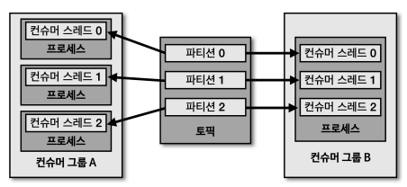

- 1 Thread - 1 Consumer (컨슈머 그룹 A)
  - 스레드에서 장애가 발생하더라도 다른 프로세스에는 영향을 미치지 않음
  - 각 스레드가 격리되어 데이터를 안전하게 처리 가능
- 1 Thread - N Consumer (컨슈머 그룹 B)
  - 배포 단계 간소화 가능
  - 스레드에서 장애가 발생한다면 다른 스레드에도 영향을 미칠 수 있음

## 컨슈머 랙(Consumer Lag)

### 컨슈머 랙

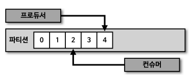

- **파티션의 최신 오프셋(LOG-END-OFFSET)과 컨슈머 오프셋(CURRENT-OFFSET) 간의 차이**
- 컨슈머 랙을 활용하여 **컨슈머가 정상 동작**하는지 확인 가능
- 컨슈머 랙은 **컨슈머 그룹과 토픽+파티션** 별로 생성됨
  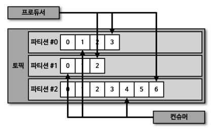
  - 1 컨슈머 그룹 , 1 토픽, 3 파티션 ⇒ 3 컨슈머 랙
  - 2 컨슈머 그룹 , 1 토픽, 3 파티션⇒ 6 컨슈머 랙
- **프로듀서와 컨슈머의 데이터 처리량**
  - 프로듀서가 보내는 데이터 양 **>** 컨슈머의 데이터 처리량
    - 컨슈머 랙 **증가**
  - 프로듀서가 보내는 데이터 양 **<** 컨슈머의 데이터 처리량
    - 컨슈머 랙 **감소**
    - 최소값 : 0 ⇒ **지연 없음**
- 컨슈머 랙 모니터링으로 확인할 수 있는 것
  **컨슈머의 장애를 확인**할 수 있고 **파티션의 개수**를 정하는 데 참고 가능

  1. **처리량** 이슈

     프로듀서의 데이터양이 늘어나면 컨슈머 랙이 증가할 수 있음

     ⇒ 파티션 개수와 컨슈머 개수를 늘려 **병렬 처리량을 늘리면** 컨슈머 랙을 줄일 수 있음

     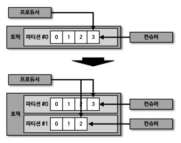

  2. **파티션** 이슈

     컨슈머는 파티션 개수만큼 늘려서 병렬 처리하며 파티션마다 컨슈머가 할당되어 데이터를 처리함

     ⇒ **컨슈머의 장애**로 인해 프로듀서의 데이터양이 일정해도 컨슈머 랙이 증가할 수 있음

     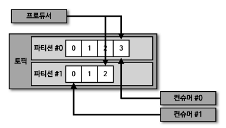

### 컨슈머 랙을 모니터링하는 방법

1. 카프카 명령어 사용 (**kafka-consumer-groups.sh**)

   - **일회성** 모니터링

   ```bash
   bin/kafka-consumer-groups.sh
   	--bootstrap-server my-kafka:9092 \
   	--group my-group \
   	--describe
   ```

2. **KafkaConsumer.metrics()** 메소드 사용

   - 컨슈머 랙 관련 모니터링 지표 : `records-lag-max`, `records-lag`, `record-lag-avg`

   ```java
   KafkaConsumer<Object, Object> kafkaConsumer = new KafkaConsumer<>(properties);
   List<String> monitoringKeys = List.of("records-lag-max", "records-lag", "records-lag-avg");

   for (Entry<MetricName, ? extends Metric> entry : kafkaConsumer.metrics().entrySet()) {
       String key = entry.getKey().name();
       if (monitoringKeys.contains(key)) {
           Metric metric = entry.getValue();
           logger.info("{} : {}", key, metric.metricValue());
       }
   }
   ```

   - `metrics()` 메소드 사용 시 단점

     - 컨슈머가 **정상 동작하는 경우에만** 확인 가능
     - 모든 컨슈머 애플리케이션에 컨슈머 랙 모니터링 코드를 **중복**해서 작성해야 함
     - **자신의 컨슈머 그룹에 대해서만** 컨슈머 랙 수집 가능
     - Java 기반 공식 라이브러리에서만 제공하므로 카프카 서드 파티 애플리케이션에서는 사용 **불가**

       ex) Fluentd, telegraf, Logstash

3. **외부 모니터링 툴**

   특정 카프카 클러스터에 연결된 모든 토픽과 모든 컨슈머 그룹에 대한 **전체 컨슈머 랙을 수집하고 확인 가능**

   ex) 데이터 독(Datadog), 컨플루언트 컨트롤 센서(Confluent Control Center), 버로우(Burrow)

   **[버로우(Burrow)](https://github.com/linkedin/Burrow)**

   - 컨슈머 랙 체크 툴
   - **REST API**를 통해 컨슈머 그룹 별로 컨슈머 랙 확인 가능
   - 설정 한 번으로 다수의 카프카 클러스터를 **동시 연결**하여 확인 가능
   - **컨슈머 랙 평가 (Evaluation)**

     - 임계치가 아니라 컨슈머 랙과 파티션의 오프셋을 **슬라이딩 윈도우**로 계산해 상태 판별하기 때문에 일시적인 현상인지 실제 이슈인지 판별 가능
       - 파티션 : OK, STALLED, STOPPED
       - 컨슈머 : OK, WARNING, ERROR

     1. 정상 작동

        파티션(OK), 컨슈머(OK)

        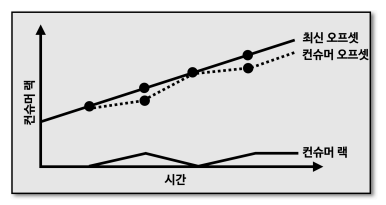

     2. 컨슈머 처리량 이슈

        파티션(OK), 컨슈머(WARNING) ⇒ 파티션과 컨슈머의 개수를 늘려 전체적인 처리량을 linear하게 늘리기

        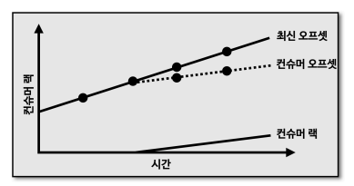

     3. 컨슈머 이슈

        파티션(STALLED), 컨슈머(ERROR) ⇒ 컨슈머가 비정상적으로 동작하므로 즉각 조치 필요

        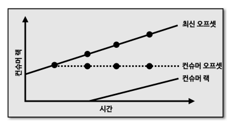
