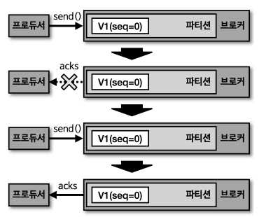
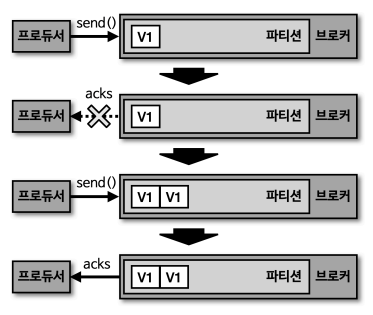
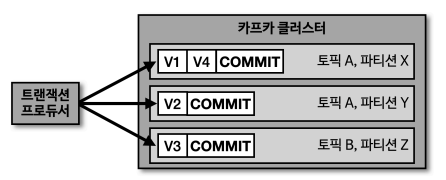
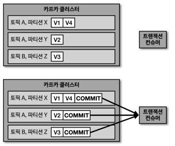

# 멱등성 프로듀서, 트랜잭션 프로듀서, 트랜잭션 컨슈머

## 멱등성 프로듀서

멱등성 : 여러 번 연산을 수행하더라도 동일한 결과를 나타냄

- **적어도 한 번 이상 전달(at least once) ⇒ 기본 프로듀서**
  적어도 한 번 이상 데이터를 적재할 수 있고, 데이터가 유실되지 않음 ⇒ 데이터 **중복** 발생 가능
- 최대 한 번 전달(at most once)
- **정확히 한 번 전달(exactly once) ⇒ 멱등성 프로듀서**
  동일한 데이터를 여러 번 전송하더라도 카프카 클러스터에 단 한 번만 저장됨

### 멱등성 프로듀서

- 데이터의 중복 적재를 막기 위해 **`enable.idempotence`** 옵션을 사용하여 멱등성 프로듀서 지원
  - default) false // true(acks=all) (kafka 3.0.0~)
  - 멱등성 프로듀서 설정 시 강제로 설정되는 옵션
    - `retries=Integer.MAX_VALUE` : 데이터 재전송 횟수 지정
    - `acks=all`
- 데이터를 한번만 전송하는 것이 아니라, 여러번 전송하되 브로커가 여러번 전송된 데이터를 확인하고 **중복된 데이터는 적재하지 않음**
- 데이터를 브로커로 전달할 때 **PID**와 **SID**를 함께 전달함
  - PID(Producer unique ID) : 프로듀서의 고유한 ID
  - SID(Sequence ID) : 레코드의 전달 번호 ID



멱등성 프로듀서인 경우



멱등성 프로듀서가 아닌 경우

### 멱등성 프로듀서의 한계

- 동일한 세션에만 정확히 한 번 전달을 보장함 ⇒ 프로듀서가 비정상적으로 종료되면 보장하지 못함
  - 동일한 세션 == PID의 생명주기

### 멱등성 프로듀서 사용 시 오류 확인


- 멱등성 프로듀서가 전송한 데이터의 PID와 시퀀스 넘버를 확인하는 과정에서 시퀀스 넘버가 일정하지 않은 경우에 **`OutOfOrderSequenceExeption`** 발생 가능
  - 브로커가 예상한 시퀀스 넘버와 다른 번호의 데이터의 적재 요청이 왔을 때 발생 ⇒ **시퀀스 넘버의 역전 현상**
  - 순서가 중요한 데이터를 전송하는 프로듀서는 이에 대응하는 방안 고려 필요

## 트랜잭션 프로듀서/컨슈머

### 트랜잭션 프로듀서



- 다수의 파티션에 데이터를 저장할 경우 모든 데이터에 대해 동일한 원자성(atomic)을 만족시키기 위해 사용
  - 다수의 데이터를 동일 트랜잭션으로 묶는다!
- 사용자가 보낸 데이터를 레코드로 파티션에 저장하고, 트랜잭션의 시작과 끝을 표현하기 위해 트랜잭션 레코드를 하나 더 보냄(commit)
- 설정 방법

  - **`transactional.id`** : 프로듀서별로 **고유한** ID 값 사용 ⇒ 이 ID를 기반으로 레코드가 묶임
  - **`init`** - **`begin`** - **`commit`** 순으로 실행

  ```java
  Properties properties = new Properties();
  properties.put(ProducerConfig.BOOTSTRAP_SERVERS_CONFIG, BOOTSTRAP_SERVERS);
  properties.put(ProducerConfig.KEY_SERIALIZER_CLASS_CONFIG, StringSerializer.class.getName());
  properties.put(ProducerConfig.VALUE_SERIALIZER_CLASS_CONFIG, StringSerializer.class.getName());
  properties.put(ProducerConfig.TRANSACTIONAL_ID_CONFIG, UUID.randomUUID());

  KafkaProducer<String, String> producer = new KafkaProducer<>(properties);

  producer.initTransactions();

  producer.beginTransaction();
  String topic = "test";
  producer.send(new ProducerRecord<>(topic, "Data1"));
  producer.send(new ProducerRecord<>(topic, "Data2"));
  producer.send(new ProducerRecord<>(topic, "Data3"));
  producer.commitTransaction();

  producer.close();
  ```

### 트랜잭션 컨슈머



- 파티션에 저장된 트랜잭션 레코드를 보고 트랜잭션이 완료되었음을 확인하고 데이터를 가져감
  - commit이 없으면 레코드가 쌓였더라도 가져가지 않음 (대기 상태로 기다림)
- 트랜잭션 프로듀서가 커밋을 수행하면 원자성을 가진 레코드들을 한번에 트랜잭션 컨슈머가 처리함
- 설정 방법

  - `isolation.level=read_committed`
    - default) `read_uncommitted` : 트랜잭션 프로듀서가 레코드를 보낸 후 커밋 여부와 상관없이 모두 읽음

  ```java
  Properties properties = new Properties();
  properties.put(ConsumerConfig.BOOTSTRAP_SERVERS_CONFIG, BOOTSTRAP_SERVERS);
  properties.put(ConsumerConfig.KEY_DESERIALIZER_CLASS_CONFIG, StringDeserializer.class.getName());
  properties.put(ConsumerConfig.VALUE_DESERIALIZER_CLASS_CONFIG, StringDeserializer.class.getName());
  properties.put(ConsumerConfig.ISOLATION_LEVEL_CONFIG, "read_committed");

  KafkaConsumer<String, String> consumer = new KafkaConsumer<>(properties);
  ```
