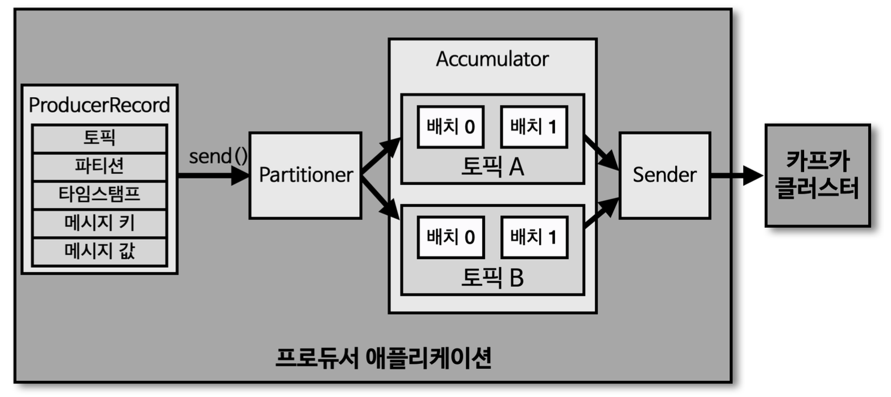
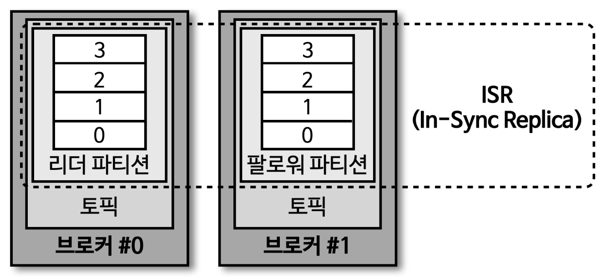
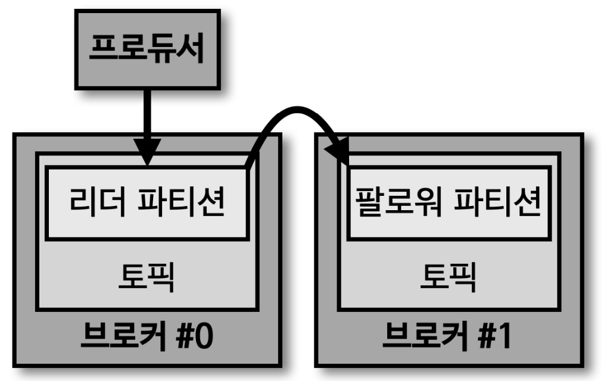
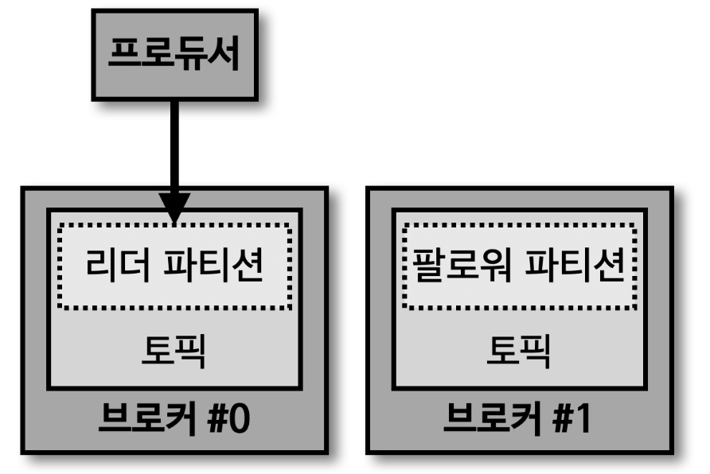
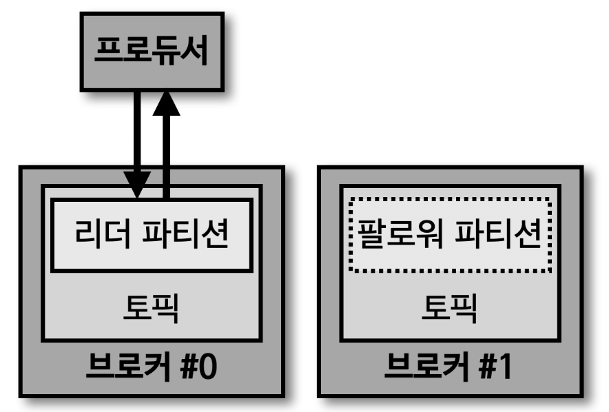
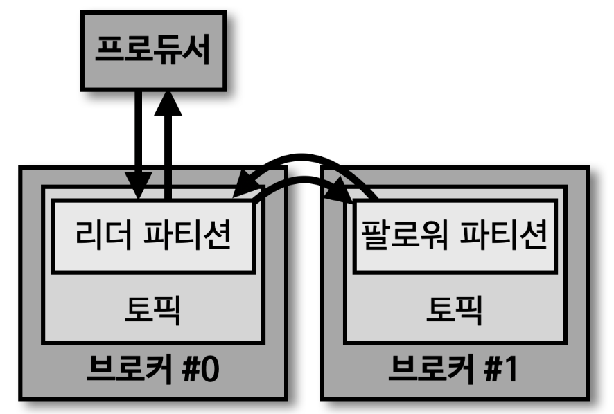
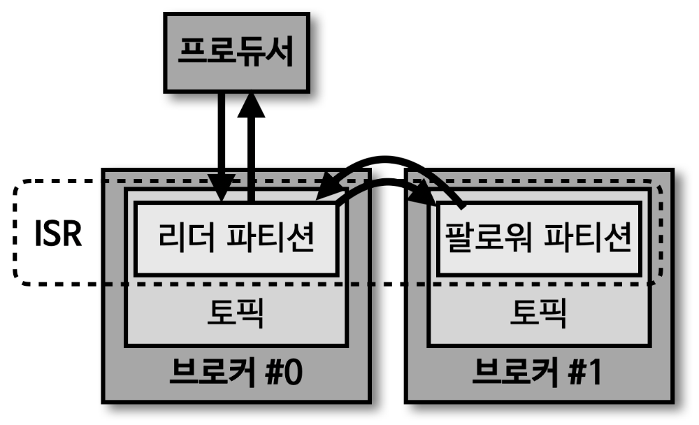

# Kafka Producer

# 카프카 프로듀서

### 카프카 프로듀서

- 카프카에 필요한 **데이터를 선언**하고 브로커의 특정 토픽의 파티션에 **전송**함.
- 데이터 전송 시 **리더 파티션을 가지고 있는 카프카 브로커와 직접 통신**함.
- 프로듀서는 카프카 브로커로 데이터 전송 시 내부적으로 파티셔너, 배치 생성 단계를 거침.

### 카프카 프로듀서의 내부 구조



- **ProducerRecord**
  - 프로듀서에서 생성하는 **레코드**
  - **토픽**과 **메시지 값**만 있어도 됨
  - **offset은 포함되지 않음** ⇒ 카프카의 특정 파티션에 데이터가 저장된 후 지정됨
- **send()**
  - 레코드 전송 **요청** 메소드
- **Partitioner**
  - **어느 파티션**으로 전송할지 지정하는 파티셔너
  - default) DefaultPartitioner
- **Accumulator**
  - **배치**로 묶어 전송할 데이터를 모으는 버퍼 ⇒ 높은 데이터 처리량
- **Sender**
  - 브로커와 통신하여 배치로 묶인 데이터를 전송함

# 파티셔너(Partitioner)

## 기본 파티셔너

`UniformStickyPartitioner` (default), `RoundRobinPartitioner`

1. 메시지 키가 **있을** 경우
   - **메시지 키의 해시값과 파티션을 매칭**하여 레코드 전송 ⇒ **동일한 메시지 키는 동일한 파티션**에 전송
   - 파티션 **개수 변경** 시, 메시지 키와 파티션 번호 매칭이 **깨짐**
2. 메시지 키가 **없을** 경우 (== null)
   - 파티션에 **최대한 동일하게** 분배
   - **RoundRobinPartitioner**
     - ProducerRecord가 **들어오는대로** 파티션을 순회하면서 전송
     - Accumulator에서 배치로 묶이는 정도가 적어 **전송 성능이 낮음**
   - **UniformStickyPartitioner**
     - RoundRobinPartitioner의 단점 개선 → **효율 극대화**
     - Acuumulator에서 레코드들이 **배치로 묶을 때까지 기다렸다가** 전송
     - 배치로 묶일 뿐 결국 파티션을 순회하면서 보내기 때문에 모든 파티션에 분배되어 전송

## 커스텀 파티셔너

- **`Partitioner` 인터페이스** 제공
- 메시지 키 또는 메시지 값에 따른 파티션 지정 로직 적용 가능

# 프로듀서 주요 옵션

### 필수 옵션

- `bootstrap.servers`
  - 프로듀서가 데이터를 전송할 대상 카프카 클러스터에 속한 브로커의 **호스트명:포트**
  - 1개 이상 작성
    - 2개 이상 브로커 정보를 입력해 일부 브로커에 이슈가 발생하더라고 접속할 수 있도록 설정 가능
- `key.serializer` : 레코드의 **메시지 키를 직렬화**하는 클래스 지정
- `value.serializer` : 레코드의 **메시지 값를 직렬화**하는 클래스 지정

### 선택 옵션

- `**acks**`
  - 프로듀서가 전송한 데이터가 브로커들에 정상적으로 저장되었는지 **전송 성공 여부 확인**
  - 0, 1, -1(all)
    - default) 1
- `linger.ms`
  - 배치를 전송하기 전까지 기다리는 최소 시간
  - default) 0 ⇒ send()로 전송 시 Sender로 **즉각 전송**
- `retries`
  - 브로커로부터 에러를 받고 난 뒤 **재전송을 시도**하는 횟수
  - default) 2147483647
- `max.in.flight.requests.per.connection`
  - 한 번에 요청하는 최대 커넥션 개수
  - 설정된 값만큼 **동시에 전달 요청 수행**
  - 데이터 처리량이 많은 경우 이 값을 튜닝
  - default) 5
- `partitioner.class`
  - 레코드를 파티션에 전송할 때 적용하는 **파티셔너 클래스** 지정
  - default) org.apache.kafka.clients.producer.internals.DefaultPartitioner
- `enable.idempotence`
  - **멱등성 프로듀서**로 동작할지 여부 설정
  - default) false(~2.x.x) // true (3.x.x~)
- `transactional.id`
  - 프로듀서가 레코드를 전송할 때 **레코드를 트랜잭션 단위로 묶을지** 여부 설정
  - 이 값을 지정하게 되면 **Transaction Producer**라고 따로 부름
  - default) null : 트랜잭션 단위로 동작하지 않고 레코드를 지속적으로 전송

# ISR(In-Sync-Replicas)와 acks 옵션

## ISR(In-Sync-Replicas)





- 리더 파티션과 팔로워 파티션이 모두 **싱크**된 상태 == 리더 파티션과 팔로워 파티션의 **오프셋이 동일**한 상태
- 싱크된 상태에서 리더 파티션과 팔로워 파티션이 안전하게 failover가 됨
- 리더 파티션에 데이터가 적재된 후 팔로워 파티션이 **복제하는 시간차 때문에** 두 파티션 간 오프셋 차이가 발생함

## acks

- 프로듀서가 전송한 데이터를 카프카 클러스터에 얼마나 **신뢰성 높게 저장**할지 지정
- 복제 개수가 1인 경우에는 미미하지만, 복제 개수가 2 이상인 경우 옵션 값에 따라 성능이 달라짐
- default) **1**

### acks=0

- 리더 파티션으로 데이터가 저장되었는지 **확인하지 않음**
- 속도가 가장 **빠르나**, 신뢰도는 가장 **낮음**
- **유실이 발생**하더라도 **전송 속도**가 중요한 경우 사용



### acks=1

- **리더 파티션에만** 정상적으로 적재되었는지 확인
- 실패 시 리더 파티션에 적재될 때까지 **재시도** 가능
- 리더 파티션에 데이터가 적재되어도, 팔로워 파티션에는 **동기화되지 않을 수 있으므로 데이터 유실 가능성 있음**



### acks=-1 (all)

- 리더 파티션과 팔로워 파티션에 **모두** 정상적으로 적재되었는지 확인
- 네트워크 **처리량이 많아 속도가 느림**
- **신뢰도 최상**
- 토픽 단위로 설정 가능한 `min.insync.replicas` 옵션값에 따라 **데이터의 안정성이 달라짐**



### acks=-1 (all), min.insync.replicas=2

- 프로듀서가 리더 파티션과 팔로워 파티션에 데이터가 적재되었는지 확인하기 위한 **최소 ISR 그룹의 파티션 개수**
- ISR 중 가장 처음 적재가 완료되는 것은 리더 파티션이기 때문에 옵션 값이 **1**인 경우 acks=1과 동일함
- acks=-1로 설정한 경우 replication factor를 적어도 2로 설정하고 min.insync.replicas를 2 이상으로 설정해야 정상적으로 동작함



# 프로듀서 애플리케이션

의존성 추가

```groovy
implementation 'org.apache.kafka:kafka-clients:2.5.0'
implementation 'org.slf4j:slf4j-simple:1.7.30'
```

1. [프로듀서 애플리케이션](./simple-kafka-producer/)
2. [메시지 키를 가진 프로듀서 애플리케이션](./kafka-producer-key-value/)
3. [파티션 번호를 지정한 프로듀서 애플리케이션](./kafka-producer-exact-partition/)
4. [커스텀 파티셔너 프로듀서 애플리케이션](./kafka-producer-custom-partitioner/)
5. 레코드 전송 결과를 확인하는 프로듀서 애플리케이션

   1. [sync](./kafka-producer-sync-callback/)

   2. [async](./kafka-producer-async-callback/)

   - KafkaProducer의 `send()` 메소드는 **Future** 객체를 반환함
   - Future 객체는 **RecordMetadata의 비동기 결과**를 표현하는 것으로 ProducerRecord가 카프카 브로커에 정상적으로 적재되었는지에 대한 데이터를 포함함
   - `get()` 메소드를 사용해 프로듀서가 보낸 데이터의 결과를 동기적으로 가져올 수 있음
     ```java
     RecordMetadata recordMetadata = producer.send(record).get();
     ```

   1. acks 값이 **0이 아닐 때**

      

      `test`라는 토픽의 `6`번 파티션에 `4`번 오프셋으로 데이터를 적재함

   2. `**acks=0**`으로 지정했을 때

      

      어느 토픽의 어느 파티션으로 전송했는지는 알 수 있지만 **응답을 받지 않았기 때문에 오프셋 번호는 알 수 없음**
