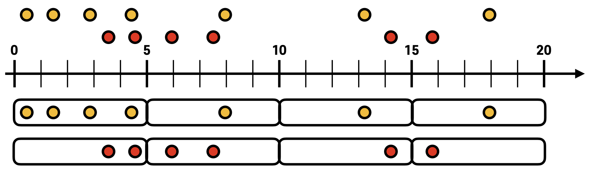

# Kafka Streams

## 카프카 스트림즈

### 카프카 스트림즈


- 토픽에 적재된 데이터를 **실시간으로 변환**하여 다른 토픽에 적재하는 라이브러리
- **장애 허용 시스템 (fault tolerant system)**을 가지고 있어 데이터 처리 안정성이 매우 뛰어남
- **Streams DSL**와 **Processor API**를 통해 스트림 데이터 처리에 필요한 다양한 기능 제공

### 카프카 스트림즈 내부 구조


- **스트림즈 애플리케이션**은 내부적으로 **1개 이상의 스레드** 생성 가능
- **스레드는 1개 이상의 태스크**를 가짐 := consumer-partition 매칭
  - 태스크(task) : 스트림즈 애플리케이션을 실행하면 생기는 데이터 처리 최소 단위


Kafka Streams Application Scale-out

- 병렬 처리를 위해 파티션과 스트림즈 스레드 또는 프로세스 개수를 늘려 처리량을 늘릴 수 있음

### 프로세서와 스트림


- 카프카 스트림즈는 **트리형 토폴로지**를 딷름
- 스트림즈의 구성 요소
  - 노드 → **프로세서(processor)**
  - 노드와 노드를 이은 선 → **스트림(stream)**
- 프로세서의 종류
  1. **소스 프로세서 (Source Processor)**
     - 데이터 처리를 위해 최초로 선언해야 하는 노드
     - 하나 이상의 토픽에서 데이터를 **가져오는** 역할
  2. **스트림 프로세서 (Stream Processor)**
     - 다른 프로세서가 반환한 **데이터 처리**
     - ex) 데이터 변환, 분기 처리
  3. **싱크 프로세서 (Sink Processor)**
     - 데이터를 특정 카프카 토픽으로 **저장**하는 역할
     - 스트림즈로 처리된 데이터의 최종 종착지
- 카프카 스트림즈 구현 방식
  1. **Streams DSL (Domain Specific Language)**
     - 스트림 프로세싱에 쓰이는 다양한 기능을 자체 API로 만들어 둠
     - ex) 메시지 값을 기반으로 토픽 분기 처리, 지난 10분간 들어온 데이터 개수 집계
  2. **Processor API**
     - Streams DSL에서 제공하지 않는 기능을 구현할 때 사용
     - ex) 메시지 값의 종류에 따라 토픽을 가변적으로 전송, 일정 시간 간격으로 데이터 처리

## Streams DSL

### KStream


- **레코드의 흐름**을 표현한 것
- **메시지 키**와 **메시지 값**으로 구성
- KStream으로 데이터를 조회하면 토픽 또는 KStream에 존재하는 **모든 레코드**가 출력됨
- KStream은 컨슈머로 토픽을 구독하는 것과 동일한 선상에서 사용하는 것

### KTable


- 메시지 키를 기준으로 **가장 최신의 메시지 값만** 노출시키는 것
- KStrema이 토픽의 모든 레코드를 조회한다면, KTable은 **unique key**를 기준으로 가장 **최신 레코드** 사용
- KTable로 데이터 조회 시 메시지 키를 기준으로 가장 **최근에 추가된 레코드의 데이터** 출력

### co-partitioning


- **KStream과 KTalbe을 조인**하기 위해 반드시 **코파티셔닝**되어 있어야 함
- **코파티셔닝 (co-partitioning)**
  1. 조인을 하는 2개 데이터의 **파티션 개수 동일**
  2. **파티셔닝 전략(partitioning strategy) 동일**
- 코파티셔닝이 된 경우 **동일한 메시지 키**를 가진 데이터가 **동일한 태스크**에 들어가는 것 보장
  ⇒ 각 태스크는 **KStream의 레코드**와 **KTable의 메시지 키**가 **동일**할 경우 조인 가능


- 코파티셔닝이 되지 **않은** 2개의 토픽을 조인하는 경우 **`TopologyException`** 발생

### GlobalKTable


- 코파티셔닝이 되지 않은 KStream과 KTable을 조인하는 법
  1. **리파티셔닝** 후 코파티셔닝이 된 상태로 조인
  2. KTable로 사용하려는 토픽을 **GlobalKTable**로 선언해 사용
- GlobalKTable로 정의된 데이터는 스트림즈 애플리케이션의 **모든 태스크에 동일하게 공유**되어 사용
  - 코파티셔닝 되지 않은 KStream과 데이터 조인 가능
  - 용량을 많이 차지함

## 스트림즈 주요 옵션

### 필수 옵션

- **`bootstrap.servers`**
  - 프로듀서가 데이터를 전송할 대상 카프카 클러스터에 속한 브로커의 **호스트명:포트**
  - 1개 이상 작성
    - 2개 이상 브로커 정보를 입력해 일부 브로커에 이슈가 발생하더라고 접속할 수 있도록 설정 가능
- **`application.id`**
  - **스트림즈 애플리케이션을 구분**하기 위한 고유 ID
  - 다른 로직을 가진 스트림즈 애플리케이션은 서로 다른 값을 가져야 함

### 선택 옵션

- `default.key.serde`
  - 레코드의 **메시지 키를 직렬화/역직렬화**하는 클래스 지정
  - default) 바이트 직렬화/역직렬화 클래스인 `Serdes.ByteArray().getClass().getName()`
- `default.value.serde`
  - 레코드의 **메시지 값을 직렬화/역직렬화**하는 클래스 지정
  - default) 바이트 직렬화/역직렬화 클래스인 `Serdes.ByteArray().getClass().getName()`
- `num.stream.threads`
  - 스트림 프로세싱 실행 시 실행될 **스레드 개수**
  - default) 1
- `state.dir`
  - 상태 기반 데이터 처리 시 **데이터를 저장할 디렉토리**
  - default) `/tmp/kafka-streams`

## 스트림즈 애플리케이션 개발하기

의존성 추가

```groovy
implementation 'org.apache.kafka:kafka-streams:2.5.0'
implementation 'org.slf4j:slf4j-simple:1.7.30'
```

1. [스트림즈 애플리케이션](/simple-kafka-streams/)

2. [**필터링** 스트림즈 애플리케이션](./kafka-streams-filter/)

   **Streams DSL**에서 제공하는 **`filter()`** 메소드 사용

   

3. [**KStream, KTable 조인** 스트림즈 애플리케이션](./kstream-ktable-join/)

   

   - KTable과 KStream은 메시지 키를 기준으로 조인 가능
   - 카프카에서는 **실시간**으로 들어오는 데이터 조인 가능 ⇒ 사용자의 이벤트 데이터를 DB에 저장하지 않고도 조인하여 스트리밍 처리 가능

     == **이벤트 기반 스트리밍 데이터 파이프라인**

4. [**KStream, GlobalKTable 조인** 스트림즈 애플리케이션](./kstream-globalktable-join/)

   

## Streams DSL - Window Processing

### Window Processing

- 스트림 데이터 분석 시 활용하는 프로세싱
- **특정 시간에 대응하여 취합 연산을 처리할 때 사용**
- 모든 프로세싱은 **메시지 키를 기준**으로 취합됨
  - 해당 토픽의 동일한 파티션에 동일한 메시지 키가 있는 레코드가 존재해야 정확한 취합 가능
  - 연산이 불가능한 경우
    - 커스텀 파티셔너를 사용하여 동일한 메시지 키가 동일한 파티션에 저장되는 것을 보장하지 못하는 경우
    - 메시지 키를 넣지 않은 경우

1. [**텀블링 윈도우 (Tumbling Window)**](./kstream-count/)

   - 서로 **겹치지 않는 윈도우**를 특정 간격으로 지속적으로 처리할 때 사용
   - 윈도우 최대 사이즈에 도달하면 해당 시점에 데이터를 취합하여 결과 도출
   - **단위 시간당 데이터**가 필요한 경우 사용
   - ex) 방문자 추이를 실시간으로 취합하는 경우
   - `groupByKey()`, `windowedBy()`

   

2. **호핑 윈도우 (Hopping Window)**

   - 일정 시간 간격으로 **겹치는 윈도우**가 존재하는 윈도우 연산을 처리할 때 사용
   - 텀블링 윈도우와 달리 동일한 키의 데이터는 서로 다른 윈도우에서 여러번 연산될 수 있음
   - 호핑 윈도우의 변수
     1. **윈도우 사이즈** : 연산을 수행할 최대 윈도우 사이즈
     2. **윈도우 간격** : 서로 다른 윈도우 간 간격

   

3. **슬라이딩 윈도우 (Sliding Window)**

   - **데이터의 정확한 시간(timestamp)**을 바탕으로 윈도우 사이즈에 포함되는 데이터를 모두 연산에 포함시킴
   - 호핑 윈도우와 유사

   

4. **세션 윈도우 (Session Window)**

   - **동일 메시지 키의 데이터**를 한 세션에 묶어 연산할 때 사용
   - 설정한 세션의 최대 만료 시간에 따라 윈도우 사이즈가 달라짐 ⇒ 윈도우 사이즈가 **가변적**임
   - 세션 만료 시간이 지나면 세션 윈도우가 종료되고 해당 윈도우의 모든 데이터를 취합하여 연산

   

### 윈도우 연산 시 주의 사항

- 카프카 스트림즈는 **커밋 단위**로 윈도우 연산 데이터를 출력함 ⇒ 동일 윈도우 사이즈(시간)의 데이터는 2개 이상 출력 될 수 있음
- 윈도우별 데이터를 출력하려면 동일 윈도우 시간 데이터는 **겹쳐쓰기(upsert)** 방식으로 처리하여 최신 데이터만 남도록 확인

## [Streams DSL - Queryable store](./queryable-store/)

토픽을 `KTable`로 사용하고 `ReadOnlyKeyValueStore`로 뷰를 가져오면 **메시지 키를 기반으로 토픽 데이터 조회 가능**

## Processor API

- [**`Proccessor`** 인터페이스](./simple-kafka-processor/)
  - 일정 로직이 이루어진 뒤 **다음 프로세서로 데이터를 넘기지 않을 때** 사용
  - `init(processorContext)` : 필요한 리소스 지정
  - `process(key, value)` : 레코드가 들어왔을 때 처리할 로직
  - `close()` : 프로세스 완료 후 안전 종료
- **`Transformer`** 인터페이스
  - 일정 로직이 이루어진 뒤 **다음 프로세서로 데이터를 넘길 때** 사용
